<div align="center">


[](https://github.com/Anji-91)
[](https://github.com/Anji-91)
[](https://www.linkedin.com/in/anjani-singh-6bb790261/)
[](https://www.instagram.com/anjani._.26/)

<br>



</div>

---

## System Brief

```yaml
name: Anjani Singh
role: Web Designer and AI Automation Developer
experience: 3+ years
education: B.Tech in Artificial Intelligence and Machine Learning, UPES
graduation: 2027
focus:
  - responsive web design
  - AI automation with Python and APIs
  - frontend development with React and Tailwind
  - app prototyping, UX/UI, and visual storytelling
```

I build digital experiences that combine clean design, practical automation, and strong presentation. My work ranges from responsive websites for real clients to AI-powered tools, data simulations, and creative content systems.

---

## Reactor Readout

<table>
  <tr>
    <td width="25%" valign="top">
      <h3>3+ Years</h3>
      <p>Hands-on experience across web design, frontend development, AI automation, and client-facing delivery.</p>
    </td>
    <td width="25%" valign="top">
      <h3>10+ Websites</h3>
      <p>Designed, developed, and maintained responsive websites for retail, healthcare, and tech clients.</p>
    </td>
    <td width="25%" valign="top">
      <h3>20% Faster</h3>
      <p>Used agile design sprints to reduce project delivery time while improving client satisfaction.</p>
    </td>
    <td width="25%" valign="top">
      <h3>500+ Users</h3>
      <p>Built a Python and API-based Discord news automation system for a large online community.</p>
    </td>
  </tr>
</table>

---

## Core Systems

<table>
  <tr>
    <td width="33%" valign="top">
      <h3>Frontend Interface</h3>
      <p>Responsive websites, UI layouts, brand-consistent pages, and fast user experiences built with HTML, CSS, JavaScript, React, and Tailwind.</p>
    </td>
    <td width="33%" valign="top">
      <h3>AI Automation Engine</h3>
      <p>Python automation, API integrations, chatbot flows, AI-powered app concepts, and workflows that reduce repetitive manual work.</p>
    </td>
    <td width="33%" valign="top">
      <h3>Research and Product Thinking</h3>
      <p>Quantitative research simulation experience, FICO-based default prediction modeling, app prototyping, and user-centered product design.</p>
    </td>
  </tr>
</table>

---

## Technical Arsenal

<div align="center">


</div>

---

## Selected Work

<table>
  <tr>
    <td width="50%" valign="top">
      <h3>AI-Powered Mental Health Chatbot</h3>
      <p>Built a Python-based NLP chatbot with sentiment analysis to provide empathetic responses and track user wellness patterns.</p>
      <p><strong>Signal:</strong> AI + NLP + wellness-focused UX.</p>
    </td>
    <td width="50%" valign="top">
      <h3>Eco-Tracker: Carbon Footprint Calculator</h3>
      <p>Created a React and Chart.js web app that connects external APIs to calculate and visualize a user's carbon footprint.</p>
      <p><strong>Signal:</strong> React + data visualization + sustainability.</p>
    </td>
  </tr>
  <tr>
    <td width="50%" valign="top">
      <h3>Automated Discord News Server</h3>
      <p>Engineered a Python bot using news APIs to automate real-time news aggregation for an online community.</p>
      <p><strong>Signal:</strong> Python + APIs + automation at community scale.</p>
    </td>
    <td width="50%" valign="top">
      <h3>AI Doctor Consultation App</h3>
      <p>Prototyped a React Native app in Figma with an AI symptom checker and a patient booking UI/UX flow.</p>
      <p><strong>Signal:</strong> app prototyping + health tech + UX planning.</p>
    </td>
  </tr>
  <tr>
    <td width="50%" valign="top">
      <h3>JPMorgan Quantitative Research Simulation</h3>
      <p>Analyzed loan data, estimated customer default probability, and used dynamic programming to convert FICO scores into categorical prediction inputs.</p>
      <p><strong>Signal:</strong> quant methods + risk modeling + data thinking.</p>
    </td>
    <td width="50%" valign="top">
      <h3>Client Website Delivery</h3>
      <p>Designed and maintained 10+ responsive websites, aligned pages with brand guidelines, and improved delivery through agile design sprints.</p>
      <p><strong>Signal:</strong> frontend delivery + client work + brand consistency.</p>
    </td>
  </tr>
</table>

---

## Credentials

<table>
  <tr>
    <td width="33%" valign="top">
      <h3>Certification Matrix</h3>
      <p>Oracle Cloud Infrastructure 2025 Certified AI Foundations Associate.</p>
      <p>JPMorgan Chase & Co. Quantitative Research Job Simulation.</p>
      <p>Aumbram startup internship certification and marketing internship experience.</p>
    </td>
    <td width="33%" valign="top">
      <h3>Education</h3>
      <p>Bachelor's Degree in Artificial Intelligence and Machine Learning.</p>
      <p>University of Petroleum and Energy Studies, expected graduation 2027.</p>
    </td>
    <td width="33%" valign="top">
      <h3>Languages</h3>
      <p>Hindi: native.</p>
      <p>English: advanced.</p>
      <p>Spanish: beginner.</p>
    </td>
  </tr>
</table>

---

## Studio Frequency

<div align="center">

[](https://open.spotify.com/)


</div>

```txt
WORKFLOW MIX
Deep focus tracks     -> code, bug fixing, layout polish
Cinematic scores      -> video pacing, storytelling, transitions
Hindi and indie music -> emotion, brand mood, creative direction
Electronic energy     -> final checks, commits, uploads
```

---

## GitHub Power Readout

<div align="center">


</div>

---

## Open To

<table>
  <tr>
    <td width="33%" valign="top">
      <h3>Web Projects</h3>
      <p>Responsive websites, landing pages, dashboards, portfolio sites, and client-focused frontend builds.</p>
    </td>
    <td width="33%" valign="top">
      <h3>AI Automation</h3>
      <p>Python bots, API workflows, AI prototypes, app concepts, and automation systems with practical use cases.</p>
    </td>
    <td width="33%" valign="top">
      <h3>Creative Tech</h3>
      <p>Brand visuals, short-form video systems, UI concepts, storytelling projects, and digital product ideas.</p>
    </td>
  </tr>
</table>

<div align="center">

[](https://www.linkedin.com/in/anjani-singh-6bb790261/)
[](https://www.instagram.com/anjani._.26/)
[](https://github.com/Anji-91)

</div>

---

<div align="center">

### Clean interfaces. Useful automation. Visual stories that land.


</div>
